# Chat API 接口流程解释 (Mermaid 图)

好的，我们来使用 Mermaid 图来可视化 `chat.py` 模块中各个接口（API 端点）的工作流程。Mermaid 是一种用文本描述图表的方式，非常直观。

我会为你分析几个核心的接口，并用 `sequenceDiagram`（序列图）来展示它们。序列图非常适合展示不同组件之间按时间顺序的交互。

假设你的前端（浏览器）是 **Client**，FastAPI 后端是 **Backend (chat.py)**，向量数据库是 **VectorDB (Chroma)**，嵌入模型服务是 **EmbeddingAPI (SiliconFlow)**，大型语言模型服务是 **LLM API (OpenRouter/DeepSeek)**，关系型数据库（存储聊天记录、用户信息等）是 **Database (PostgreSQL)**。

---

### 1. `POST /api/v1/chat/` - 发送聊天消息并获取回复 (核心 RAG 流程)

这是最复杂的接口，实现了完整的 RAG 对话流程。

```mermaid
sequenceDiagram
    participant Client
    participant Backend (chat.py)
    participant Auth
    participant Database (PostgreSQL)
    participant VectorDB (Chroma)
    participant EmbeddingAPI (SiliconFlow)
    participant LLM API (OpenRouter/DeepSeek)
    participant ChatHistory Module
    participant VectorStore Module

    Client->>+Backend (chat.py): 发送 POST 请求 (问题 query, session_id, etc.) + Token
    Note right of Client: 用户在聊天框输入问题并发起请求

    Backend (chat.py)->>+Auth: 验证 Token
    Auth-->>-Backend (chat.py): 返回用户信息 (current_user)
    Note right of Backend (chat.py): 确认用户身份

    Backend (chat.py)->>+Database (PostgreSQL): 获取数据库会话 (Session)
    Database (PostgreSQL)-->>-Backend (chat.py): 返回数据库会话

    Backend (chat.py)->>+ChatHistory Module: 调用 get_chat_history(user_id, session_id)
    Note right of Backend (chat.py): 获取最近的对话历史作为上下文
    ChatHistory Module->>+Database (PostgreSQL): 查询 chat_history 表
    Database (PostgreSQL)-->>-ChatHistory Module: 返回历史消息记录
    ChatHistory Module-->>-Backend (chat.py): 返回格式化后的历史 (history_messages)

    Backend (chat.py)->>+VectorStore Module: 调用 search_documents(query, user_id)
    Note right of Backend (chat.py): 根据用户问题搜索相关知识库文档
    VectorStore Module->>+EmbeddingAPI (SiliconFlow): 将 query 文本发送给嵌入模型
    EmbeddingAPI (SiliconFlow)-->>-VectorStore Module: 返回 query 的向量表示
    VectorStore Module->>+VectorDB (Chroma): 使用 query 向量进行相似度搜索 (带 user_id 过滤)
    VectorDB (Chroma)-->>-VectorStore Module: 返回最相关的文档块 (retrieved_docs)
    VectorStore Module-->>-Backend (chat.py): 返回检索到的文档块

    Backend (chat.py)->>Backend (chat.py): 构建最终的 Prompt
    Note right of Backend (chat.py): 组合：系统指令 + 历史消息 + 检索到的文档 + 用户当前问题

    Backend (chat.py)->>+LLM API (OpenRouter/DeepSeek): 发送构建好的 Prompt
    Note right of Backend (chat.py): 请求大模型根据上下文生成回答
    LLM API (OpenRouter/DeepSeek)-->>-Backend (chat.py): 返回 AI 生成的回答 (ai_response)

    Backend (chat.py)->>+ChatHistory Module: 调用 add_chat_message(user_id, session_id, query, ai_response)
    Note right of Backend (chat.py): 将当前这轮对话存入历史记录
    ChatHistory Module->>+Database (PostgreSQL): 将用户问题和 AI 回答插入 chat_history 表
    Database (PostgreSQL)-->>-ChatHistory Module: 确认插入成功
    ChatHistory Module-->>-Backend (chat.py): 返回状态

    Backend (chat.py)-->>-Client: 返回 200 OK (包含 ai_response 和可能的 sources)
    Note right of Client: 接收到 AI 的回答并显示在界面上
```

**解释:**

1.  **用户发起请求:** 客户端（你的网页或应用）将用户输入的问题、会话 ID 等信息，连同用于身份验证的 Token，发送给后端的 `/api/v1/chat/` 接口。
2.  **身份验证:** 后端首先检查 Token 是否有效，确认是哪个用户在操作。
3.  **获取数据库连接:** 准备好和 PostgreSQL 数据库进行交互。
4.  **获取对话历史:** 调用 `ChatHistory` 模块的功能，从数据库里捞取当前会话最近的几条聊天记录，作为理解上下文的一部分。
5.  **检索相关文档:** 调用 `VectorStore` 模块的功能：
    - 先把用户的问题 (`query`) 发给 SiliconFlow API，把它变成一串数字（向量）。
    - 然后拿着这个向量去 ChromaDB 里搜索，找出数据库里存着的、和这个问题最“像”的几个文档片段（并且确保只在当前用户的文档里搜）。
6.  **构建 Prompt:** 把系统指令（比如“你是一个育儿助手”）、刚才拿到的对话历史、刚检索到的文档片段、以及用户当前的问题，组合成一个完整的、信息丰富的文本，准备发给大模型。
7.  **调用大模型:** 把这个精心准备的 Prompt 发送给 OpenRouter 上的 DeepSeek 模型。
8.  **获取 AI 回答:** 大模型根据收到的所有信息，生成一个回答。
9.  **存储对话:** 把用户刚才问的问题和 AI 生成的回答，作为一个新的记录，存到 PostgreSQL 数据库的 `chat_history` 表里，方便以后查阅。
10. **返回给用户:** 把 AI 的回答发送回客户端显示给用户。

---

### 2. `GET /api/v1/chat/history` - 获取聊天历史记录

这个接口用于获取指定会话或孩子的历史聊天记录。

**解释:**

1.  **用户发起请求:** 客户端发送请求，可能带有会话 ID、孩子 ID、分页参数（跳过多少条 `skip`，获取多少条 `limit`）和 Token。
2.  **身份验证:** 确认用户身份。
3.  **获取数据库连接:** 准备和数据库交互。
4.  **查询历史记录:** 调用 `ChatHistory` 模块，让它去数据库里查：
    - 只查当前用户的 (`user_id`)。
    - 如果提供了 `session_id` 或 `child_id`，还要根据这些条件过滤。
    - 根据 `skip` 和 `limit` 实现分页，避免一次返回太多数据。
5.  **格式化数据:** 后端将从数据库查到的原始数据，整理成 API 接口约定好的格式（由 `ChatHistoriesPublic` 这个 Pydantic 模型定义）。
6.  **返回给用户:** 将整理好的聊天记录列表返回给客户端。

---

### 3. `GET /api/v1/chat/models` - 获取可用模型列表

这个接口比较简单，通常用于告诉前端有哪些 LLM 模型可以选择。

**解释:**

1.  **用户发起请求:** 客户端请求模型列表。
2.  **身份验证 (可选):** 如果需要，确认用户身份。
3.  **获取模型列表:** 后端直接在代码里创建一个包含模型信息的列表（比如 GPT-4o Mini, Claude 3 Opus 的 ID、名称、提供商、描述等）。这些信息通常是预先定义好的。
4.  **返回给用户:** 将这个模型信息列表返回给客户端。

---

希望这些图和解释能帮助你更好地理解 `chat.py` 模块中各个接口的工作流程！如果有任何不清楚的地方，随时问我。

---

## 创建和管理儿童信息：

1.  **获取用户认证 Token:** 通过登录接口 (`/api/v1/login/access-token`) 获取。
2.  **创建:** 向 `POST /api/v1/children/` 发送包含儿童信息的 JSON (符合 `ChildCreate` 格式)，并在请求头中附带 Token。
3.  **查看列表:** 向 `GET /api/v1/children/` 发送请求 (附带 Token)。
4.  **查看单个:** 向 `GET /api/v1/children/{child_id}` 发送请求 (附带 Token)。
5.  **更新:** 向 `PUT /api/v1/children/{child_id}` 发送包含要更新字段的 JSON (符合 `ChildUpdate` 格式)，并附带 Token。
6.  **删除:** 向 `DELETE /api/v1/children/{child_id}` 发送请求 (附带 Token)。
