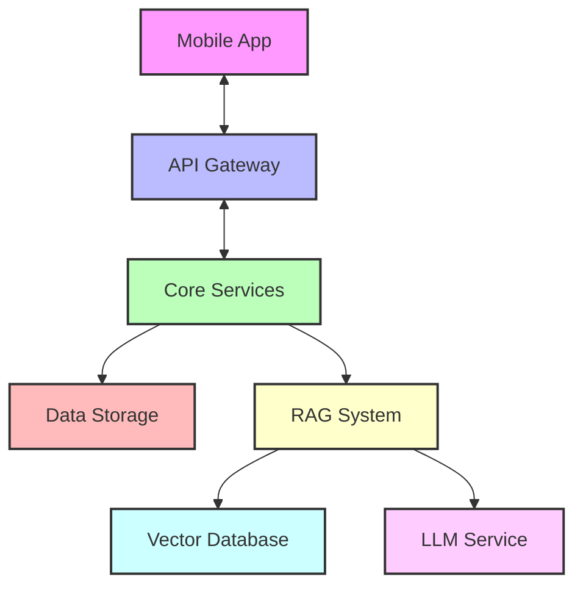

# AI 育儿助手项目架构设计文档（优化版）

## 1. 系统概述

### 1.1 项目背景

面向 0-3 岁婴幼儿家庭的移动端育儿助手应用，通过 AI 技术提供个性化育儿建议和科学指导，帮助家长科学轻松育儿。

### 1.2 核心目标

- 便捷记录儿童成长数据
- 提供个性化 AI 智能问答
- 科学的养育建议推送
- 确保数据安全和隐私保护

## 2. 技术架构

### 2.1 整体架构

采用模块化的分层架构，确保系统的可扩展性和可维护性：



### 2.2 技术选型

#### 前端技术栈

- 框架：Flutter（跨平台支持）
- 状态管理：Provider/Riverpod
- 网络：Dio
- 本地存储：Hive/SQLite
- UI 组件：Material Design 3

#### 后端技术栈

- 主框架：**FastAPI**（高性能异步框架）
- 数据库：
  - PostgreSQL（主数据库）
  - Redis（缓存层）
  - **Chroma/Qdrant**（向量存储）
- AI 集成：
  - **LangChain**（RAG 框架）
  - OpenAI API（嵌入和语言模型）
- 文档处理：
  - PyPDFLoader（PDF 处理）
  - Docx2txtLoader（Word 文档处理）
  - UnstructuredHTMLLoader（HTML 处理）

#### 基础设施

- 容器化：Docker
- 编排：Docker Compose（MVP 阶段）/ Kubernetes（扩展阶段）
- CI/CD：GitHub Actions
- 监控：Prometheus + Grafana
- 日志：ELK Stack

## 3. 核心模块设计

### 3.1 用户认证模块


- JWT 认证
- OAuth 2.0 社交登录
- RBAC 权限控制
- 手机号+验证码登录

### 3.2 数据记录模块

#### 数据模型

```python
# SQLModel 模型定义
class Child(SQLModel, table=True):
    id: UUID = Field(default_factory=uuid.uuid4, primary_key=True)
    name: str
    birthday: date
    gender: str
    parent_id: UUID = Field(foreign_key="user.id")
    created_at: datetime = Field(default_factory=datetime.utcnow)
    updated_at: datetime = Field(default_factory=datetime.utcnow)

class GrowthRecord(SQLModel, table=True):
    id: UUID = Field(default_factory=uuid.uuid4, primary_key=True)
    child_id: UUID = Field(foreign_key="child.id")
    record_type: str  # 喂养、睡眠、排便等
    record_value: dict  # JSON 数据
    recorded_at: datetime
    notes: str = None
    attachments: List[str] = Field(default=[])
    created_at: datetime = Field(default_factory=datetime.utcnow)
```

#### 核心功能

- 实时数据同步
- 离线数据存储
- 数据导入导出
- 多设备同步
- 数据备份恢复

### 3.3 AI 问答系统

#### RAG 系统架构

基于 LangChain 的 RAG 实现：


#### 模块化实现

```python
# 主要组件
class RAGSystem:
    def __init__(self):
        self.embedding_function = OpenAIEmbeddings()
        self.vectorstore = Chroma(
            persist_directory="./chroma_db", 
            embedding_function=self.embedding_function
        )
        self.retriever = self.vectorstore.as_retriever(search_kwargs={"k": 3})
        self.llm = ChatOpenAI(model="gpt-4o-mini")
        self.rag_chain = self._create_rag_chain()
    
    def _create_rag_chain(self):
        # 创建历史感知检索器
        history_aware_retriever = create_history_aware_retriever(
            self.llm, 
            self.retriever, 
            self._get_contextualize_q_prompt()
        )
        
        # 创建问答链
        question_answer_chain = create_stuff_documents_chain(
            self.llm, 
            self._get_qa_prompt()
        )
        
        # 创建完整的RAG链
        return create_retrieval_chain(
            history_aware_retriever, 
            question_answer_chain
        )
    
    def answer_question(self, question: str, chat_history: List[dict], child_info: dict = None):
        # 构建上下文
        context = {
            "input": question,
            "chat_history": chat_history
        }
        
        if child_info:
            context["child_info"] = child_info
            
        # 调用RAG链
        return self.rag_chain.invoke(context)
```

#### 知识库结构

- 专业指南文献
- 育儿知识图谱
- 问答历史记录
- 用户反馈数据
- 月龄阶段发展指南

### 3.4 推荐系统

- 基于月龄的内容推荐
- 个性化建议生成
- 智能提醒服务

## 4. 数据库设计

### 4.1 关系数据库设计

```sql
-- 用户表
CREATE TABLE users (
    id UUID PRIMARY KEY,
    phone VARCHAR(20) UNIQUE,
    email VARCHAR(255),
    password_hash VARCHAR(255),
    created_at TIMESTAMP,
    updated_at TIMESTAMP
);

-- 儿童信息表
CREATE TABLE children (
    id UUID PRIMARY KEY,
    parent_id UUID REFERENCES users(id),
    name VARCHAR(50),
    birthday DATE,
    gender VARCHAR(10),
    created_at TIMESTAMP,
    updated_at TIMESTAMP
);

-- 成长记录表
CREATE TABLE growth_records (
    id UUID PRIMARY KEY,
    child_id UUID REFERENCES children(id),
    record_type VARCHAR(20),
    record_data JSONB,
    recorded_at TIMESTAMP,
    notes TEXT,
    attachments JSONB,
    created_at TIMESTAMP
);

-- 聊天历史表
CREATE TABLE chat_history (
    id UUID PRIMARY KEY,
    user_id UUID REFERENCES users(id),
    child_id UUID REFERENCES children(id),
    session_id VARCHAR(50),
    user_query TEXT,
    ai_response TEXT,
    model VARCHAR(50),
    created_at TIMESTAMP
);

-- 文档元数据表
CREATE TABLE document_store (
    id UUID PRIMARY KEY,
    title VARCHAR(255),
    filename VARCHAR(255),
    file_type VARCHAR(20),
    upload_timestamp TIMESTAMP,
    status VARCHAR(20),
    metadata JSONB
);
```

### 4.2 向量数据库设计

使用 Chroma 存储文档嵌入：

```python
# 向量存储初始化
embedding_function = OpenAIEmbeddings()
vectorstore = Chroma(
    persist_directory="./chroma_db",
    embedding_function=embedding_function
)

# 文档处理与索引
def process_and_index_document(file_path: str, file_id: str, metadata: dict = None):
    # 根据文件类型选择加载器
    if file_path.endswith('.pdf'):
        loader = PyPDFLoader(file_path)
    elif file_path.endswith('.docx'):
        loader = Docx2txtLoader(file_path)
    elif file_path.endswith('.html'):
        loader = UnstructuredHTMLLoader(file_path)
    else:
        raise ValueError(f"不支持的文件类型: {file_path}")
    
    # 加载文档
    documents = loader.load()
    
    # 文本分割
    text_splitter = RecursiveCharacterTextSplitter(
        chunk_size=1000, 
        chunk_overlap=200
    )
    splits = text_splitter.split_documents(documents)
    
    # 添加元数据
    for split in splits:
        split.metadata['file_id'] = file_id
        if metadata:
            split.metadata.update(metadata)
    
    # 添加到向量存储
    vectorstore.add_documents(splits)
    
    return len(splits)
```

## 5. API 设计

### 5.1 RESTful API

```
/api/v1/
├── auth/
│   ├── login                  # 用户登录
│   ├── register               # 用户注册
│   └── refresh-token          # 刷新令牌
├── children/
│   ├── {child_id}             # 获取/更新儿童信息
│   ├── records                # 获取成长记录
│   └── growth-data            # 添加/更新成长数据
├── ai/
│   ├── chat                   # RAG 聊天接口
│   └── suggestions            # 获取养育建议
├── documents/
│   ├── upload                 # 上传文档
│   ├── list                   # 列出文档
│   └── delete                 # 删除文档
└── knowledge/
    ├── articles               # 获取文章
    └── tips                   # 获取育儿技巧
```

### 5.2 FastAPI 实现

```python
# main.py
from fastapi import FastAPI, File, UploadFile, HTTPException, Depends
from pydantic import BaseModel, Field
from typing import List, Optional
from uuid import UUID, uuid4
from datetime import datetime
import os
import shutil

app = FastAPI(title="AI 育儿助手 API")

# 聊天请求模型
class ChatRequest(BaseModel):
    question: str
    session_id: Optional[str] = None
    child_id: Optional[UUID] = None

# 聊天响应模型
class ChatResponse(BaseModel):
    answer: str
    session_id: str
    sources: List[dict] = []

# 聊天端点
@app.post("/api/v1/ai/chat", response_model=ChatResponse)
async def chat(request: ChatRequest):
    # 生成会话ID（如果未提供）
    session_id = request.session_id or str(uuid4())
    
    # 获取聊天历史
    chat_history = get_chat_history(session_id)
    
    # 获取儿童信息（如果提供了child_id）
    child_info = None
    if request.child_id:
        child_info = get_child_info(request.child_id)
    
    # 调用RAG系统
    rag_system = get_rag_system()
    result = rag_system.answer_question(
        question=request.question,
        chat_history=chat_history,
        child_info=child_info
    )
    
    # 记录交互
    save_chat_interaction(
        session_id=session_id,
        user_query=request.question,
        ai_response=result["answer"],
        child_id=request.child_id
    )
    
    return ChatResponse(
        answer=result["answer"],
        session_id=session_id,
        sources=[doc.metadata for doc in result.get("source_documents", [])]
    )

# 文档上传端点
@app.post("/api/v1/documents/upload")
async def upload_document(file: UploadFile = File(...)):
    # 检查文件类型
    allowed_extensions = ['.pdf', '.docx', '.html']
    file_extension = os.path.splitext(file.filename)[1].lower()
    
    if file_extension not in allowed_extensions:
        raise HTTPException(
            status_code=400, 
            detail=f"不支持的文件类型。允许的类型有: {', '.join(allowed_extensions)}"
        )
    
    # 保存临时文件
    temp_file_path = f"temp_{file.filename}"
    try:
        with open(temp_file_path, "wb") as buffer:
            shutil.copyfileobj(file.file, buffer)
        
        # 创建文档记录
        file_id = str(uuid4())
        metadata = {
            "filename": file.filename,
            "file_type": file_extension[1:],
            "upload_timestamp": datetime.utcnow().isoformat()
        }
        
        # 保存文档元数据
        save_document_metadata(file_id, metadata)
        
        # 处理并索引文档
        chunk_count = process_and_index_document(
            file_path=temp_file_path,
            file_id=file_id,
            metadata=metadata
        )
        
        return {
            "message": f"文件 {file.filename} 已成功上传并索引。",
            "file_id": file_id,
            "chunk_count": chunk_count
        }
    except Exception as e:
        # 删除文档记录（如果已创建）
        delete_document_metadata(file_id)
        raise HTTPException(status_code=500, detail=f"处理文档时出错: {str(e)}")
    finally:
        # 清理临时文件
        if os.path.exists(temp_file_path):
            os.remove(temp_file_path)
```

## 6. 安全设计

### 6.1 数据安全

- 端到端加密
- 敏感数据脱敏
- 数据访问审计
- 定期数据备份

### 6.2 应用安全

- JWT 认证与授权
- API 访问限流
- 输入验证与清理
- SQL 注入防护
- XSS 防护
- CSRF 防护

### 6.3 AI 安全

```python
# 安全检查中间件
def ai_safety_middleware(response: str) -> str:
    # 检查医疗建议
    if contains_medical_terms(response):
        response = add_medical_disclaimer(response)
    
    # 检查敏感内容
    if contains_sensitive_content(response):
        response = filter_sensitive_content(response)
    
    # 添加通用免责声明
    response += "\n\n注意：本回答仅供参考，不构成医疗建议。如有健康问题，请咨询专业医生。"
    
    return response
```

## 7. 性能优化

### 7.1 缓存策略

```python
# 缓存实现
class ResponseCache:
    def __init__(self, redis_client):
        self.redis = redis_client
        self.ttl = 3600  # 1小时缓存
    
    def get_cache_key(self, question: str, child_id: str = None):
        # 创建唯一缓存键
        question_hash = hashlib.md5(question.encode()).hexdigest()
        if child_id:
            return f"ai:response:{child_id}:{question_hash}"
        return f"ai:response:{question_hash}"
    
    def get_cached_response(self, question: str, child_id: str = None):
        cache_key = self.get_cache_key(question, child_id)
        cached = self.redis.get(cache_key)
        if cached:
            return json.loads(cached)
        return None
    
    def cache_response(self, question: str, response: dict, child_id: str = None):
        cache_key = self.get_cache_key(question, child_id)
        self.redis.setex(
            cache_key,
            self.ttl,
            json.dumps(response)
        )
```

### 7.2 异步处理

```python
# 异步RAG处理
async def process_rag_request(question: str, chat_history: List[dict], child_info: dict = None):
    # 检查缓存
    cache_key = get_cache_key(question, child_info)
    cached_response = await get_cached_response(cache_key)
    if cached_response:
        return cached_response
    
    # 异步处理RAG请求
    async with AsyncRAGProcessor() as processor:
        # 构建上下文
        context = await build_context(question, chat_history, child_info)
        
        # 检索相关文档
        documents = await processor.retrieve_documents(context)
        
        # 生成回答
        response = await processor.generate_answer(question, documents, chat_history)
        
        # 缓存结果
        await cache_response(cache_key, response)
        
        return response
```

## 8. 部署架构

### 8.1 Docker 容器化

```dockerfile
# Dockerfile
FROM python:3.10-slim

WORKDIR /app

# 安装依赖
COPY requirements.txt .
RUN pip install --no-cache-dir -r requirements.txt

# 复制应用代码
COPY . .

# 设置环境变量
ENV PYTHONPATH=/app

# 启动应用
CMD ["uvicorn", "main:app", "--host", "0.0.0.0", "--port", "8000"]
```

### 8.2 Docker Compose 配置

```yaml
# docker-compose.yml
version: '3.8'

services:
  api:
    build: .
    ports:
      - "8000:8000"
    environment:
      - DATABASE_URL=postgresql://postgres:password@db:5432/parenting
      - REDIS_URL=redis://redis:6379/0
      - OPENAI_API_KEY=${OPENAI_API_KEY}
    volumes:
      - ./app:/app
      - ./chroma_db:/app/chroma_db
    depends_on:
      - db
      - redis

  db:
    image: postgres:15
    environment:
      - POSTGRES_USER=postgres
      - POSTGRES_PASSWORD=password
      - POSTGRES_DB=parenting
    volumes:
      - postgres_data:/var/lib/postgresql/data

  redis:
    image: redis:alpine
    volumes:
      - redis_data:/data

volumes:
  postgres_data:
  redis_data:
```

## 9. 监控与日志

### 9.1 日志配置

```python
# 日志配置
import logging
from logging.handlers import RotatingFileHandler

def setup_logging():
    # 创建日志格式
    log_format = "%(asctime)s - %(name)s - %(levelname)s - %(message)s"
    formatter = logging.Formatter(log_format)
    
    # 创建文件处理器
    file_handler = RotatingFileHandler(
        "app.log", 
        maxBytes=10*1024*1024,  # 10MB
        backupCount=5
    )
    file_handler.setFormatter(formatter)
    
    # 创建控制台处理器
    console_handler = logging.StreamHandler()
    console_handler.setFormatter(formatter)
    
    # 配置根日志器
    root_logger = logging.getLogger()
    root_logger.setLevel(logging.INFO)
    root_logger.addHandler(file_handler)
    root_logger.addHandler(console_handler)
    
    # 配置特定模块日志器
    rag_logger = logging.getLogger("rag")
    rag_logger.setLevel(logging.DEBUG)
    
    return root_logger
```

### 9.2 性能监控

```python
# 性能监控中间件
@app.middleware("http")
async def add_process_time_header(request: Request, call_next):
    start_time = time.time()
    
    # 记录请求信息
    request_id = str(uuid4())
    logging.info(f"Request {request_id} started: {request.method} {request.url.path}")
    
    # 处理请求
    response = await call_next(request)
    
    # 计算处理时间
    process_time = time.time() - start_time
    response.headers["X-Process-Time"] = str(process_time)
    
    # 记录响应信息
    logging.info(f"Request {request_id} completed in {process_time:.4f}s with status {response.status_code}")
    
    # 记录性能指标
    if process_time > 1.0:
        logging.warning(f"Slow request {request_id}: {request.method} {request.url.path} took {process_time:.4f}s")
    
    return response
```

## 10. 测试策略

### 10.1 单元测试

```python
# test_rag.py
import pytest
from unittest.mock import MagicMock, patch
from rag_system import RAGSystem

def test_rag_system_initialization():
    rag = RAGSystem()
    assert rag.retriever is not None
    assert rag.llm is not None
    assert rag.rag_chain is not None

@patch("rag_system.OpenAIEmbeddings")
@patch("rag_system.Chroma")
@patch("rag_system.ChatOpenAI")
def test_answer_question(mock_chat, mock_chroma, mock_embeddings):
    # 设置模拟对象
    mock_retriever = MagicMock()
    mock_chroma.return_value.as_retriever.return_value = mock_retriever
    
    mock_chain = MagicMock()
    mock_chain.invoke.return_value = {
        "answer": "这是一个测试回答",
        "source_documents": []
    }
    
    # 创建RAG系统
    with patch("rag_system.create_retrieval_chain", return_value=mock_chain):
        rag = RAGSystem()
        
        # 测试回答问题
        result = rag.answer_question(
            question="测试问题",
            chat_history=[]
        )
        
        # 验证结果
        assert result["answer"] == "这是一个测试回答"
        mock_chain.invoke.assert_called_once()
```

### 10.2 集成测试

```python
# test_api.py
from fastapi.testclient import TestClient
from main import app

client = TestClient(app)

def test_chat_endpoint():
    response = client.post(
        "/api/v1/ai/chat",
        json={"question": "如何安抚哭闹的婴儿?"}
    )
    assert response.status_code == 200
    data = response.json()
    assert "answer" in data
    assert "session_id" in data

def test_document_upload():
    with open("test_document.pdf", "rb") as f:
        response = client.post(
            "/api/v1/documents/upload",
            files={"file": ("test_document.pdf", f, "application/pdf")}
        )
    assert response.status_code == 200
    data = response.json()
    assert "file_id" in data
    assert "message" in data
```

## 11. MVP 实施路线图

### 11.1 阶段一：基础设施搭建（2周）

- 设置开发环境
- 实现数据库模型
- 创建基本API框架
- 配置Docker容器

### 11.2 阶段二：核心功能实现（4周）

- 用户认证系统
- 儿童信息管理
- 成长数据记录
- RAG系统基础实现

### 11.3 阶段三：AI 能力增强（3周）

- 知识库建设
- 提示词优化
- 上下文理解增强
- 答案质量提升

### 11.4 阶段四：测试与优化（3周）

- 单元测试编写
- 集成测试
- 性能优化
- 安全审查

### 11.5 阶段五：部署与监控（2周）

- 生产环境配置
- CI/CD 流程设置
- 监控系统部署
- 日志分析工具

## 12. 总结

本架构设计文档提供了 AI 育儿助手项目的详细技术规划，重点关注：

1. 基于 FastAPI 和 LangChain 的 RAG 系统实现
2. 模块化、可扩展的系统设计
3. 安全、高效的数据处理
4. 容器化部署与监控
5. 全面的测试策略

通过这一架构，我们能够构建一个高质量的 MVP 产品，为家长提供科学、个性化的育儿指导，并为未来功能扩展奠定坚实基础。
