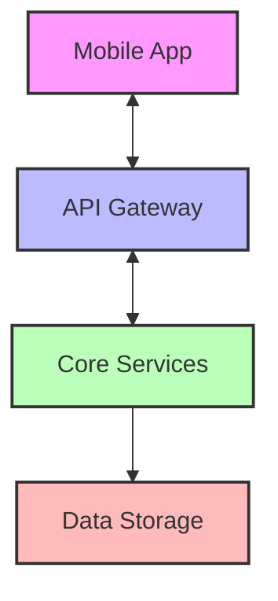
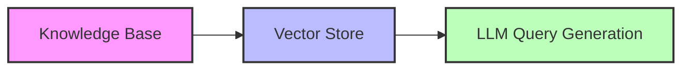
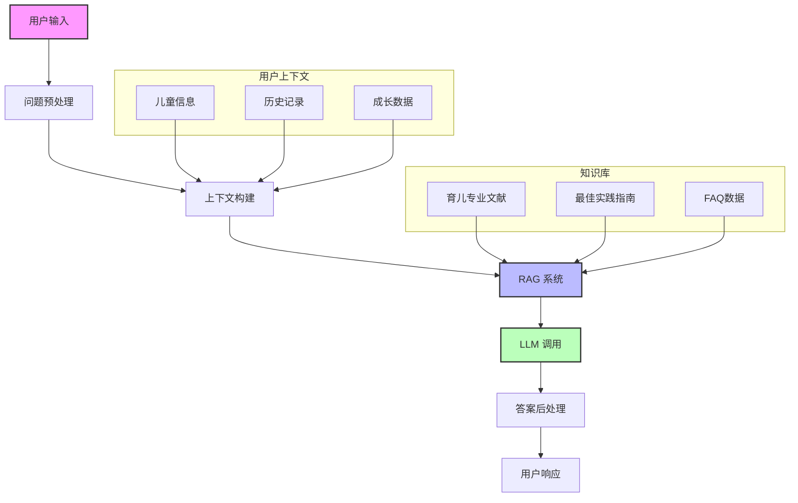
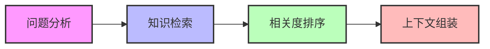

# AI 育儿助手项目架构设计文档

## 1. 系统概述

### 1.1 项目背景

面向 0-3 岁婴幼儿家庭的移动端育儿助手应用，通过 AI 技术提供个性化育儿建议和科学指导。

### 1.2 核心目标

- 便捷记录儿童成长数据
- 提供个性化 AI 智能问答
- 科学的养育建议推送
- 确保数据安全和隐私保护

## 2. 技术架构

### 2.1 整体架构

采用现代化的分布式微服务架构：



### 2.2 技术选型

#### 前端技术栈

- 框架：Flutter（跨平台支持）
- 状态管理：Provider/Riverpod
- 网络：Dio
- 本地存储：Hive/SQLite
- UI 组件：Material Design 3

#### 后端技术栈

- 主框架：FastAPI
- 数据库：
  - PostgreSQL（主数据库）
  - Redis（缓存层）
  - Pgvector（向量存储）
- 搜索引擎：Elasticsearch
- 消息队列：RabbitMQ
- AI 模型：硅基流动 API + 自定义 RAG 系统

#### 基础设施

- 容器化：Docker
- 编排：Kubernetes
- CI/CD：GitLab CI
- 监控：Prometheus + Grafana
- 日志：ELK Stack

## 3. 核心模块设计

### 3.1 用户认证模块


- JWT 认证
- OAuth 2.0 社交登录
- RBAC 权限控制
- 手机号+验证码登录

### 3.2 数据记录模块

#### 数据模型

```sql
-- 儿童信息
Child {
    id: UUID
    name: String
    birthday: Date
    gender: Enum
    parent_id: UUID
    created_at: Timestamp
    updated_at: Timestamp
}

-- 成长记录
GrowthRecord {
    id: UUID
    child_id: UUID
    record_type: Enum
    record_value: JSON
    recorded_at: Timestamp
    notes: Text
    attachments: Array<String>
}
```

#### 核心功能

- 实时数据同步
- 离线数据存储
- 数据导入导出
- 多设备同步
- 数据备份恢复

### 3.3 AI 问答系统

#### RAG 系统架构



#### 知识库结构

- 专业指南文献
- 育儿知识图谱
- 问答历史记录
- 用户反馈数据

### 3.4 推荐系统

- 基于月龄的内容推荐
- 个性化建议生成
- 智能提醒服务

## 4. 数据库设计

### 4.1 核心表结构

```sql
-- 用户表
CREATE TABLE users (
    id UUID PRIMARY KEY,
    phone VARCHAR(20) UNIQUE,
    email VARCHAR(255),
    password_hash VARCHAR(255),
    created_at TIMESTAMP,
    updated_at TIMESTAMP
);

-- 儿童信息表
CREATE TABLE children (
    id UUID PRIMARY KEY,
    parent_id UUID REFERENCES users(id),
    name VARCHAR(50),
    birthday DATE,
    gender VARCHAR(10),
    created_at TIMESTAMP,
    updated_at TIMESTAMP
);

-- 成长记录表
CREATE TABLE growth_records (
    id UUID PRIMARY KEY,
    child_id UUID REFERENCES children(id),
    record_type VARCHAR(20),
    record_data JSONB,
    recorded_at TIMESTAMP,
    created_at TIMESTAMP
);

-- 知识库表
CREATE TABLE knowledge_base (
    id UUID PRIMARY KEY,
    title TEXT,
    content TEXT,
    metadata JSONB,
    embedding vector(1536),
    created_at TIMESTAMP
);
```

### 4.2 索引策略

- 复合索引优化
- 全文搜索索引
- 向量索引优化

## 5. API 设计

### 5.1 RESTful API

```
/api/v1/
├── auth/
│   ├── login
│   ├── register
│   └── refresh-token
├── children/
│   ├── {child_id}
│   ├── records
│   └── growth-data
├── ai/
│   ├── ask
│   └── suggestions
└── knowledge/
    ├── articles
    └── tips
```

### 5.2 WebSocket 接口

- 实时数据同步
- 消息推送
- 在线状态维护

## 6. 安全设计

### 6.1 数据安全

- 端到端加密
- 敏感数据脱敏
- 数据访问审计
- 定期数据备份

### 6.2 应用安全

- API 访问限流
- SQL 注入防护
- XSS 防护
- CSRF 防护

## 7. 性能优化

### 7.1 缓存策略

- 多级缓存
- 分布式缓存
- 本地缓存

### 7.2 查询优化

- 索引优化
- 查询计划优化
- 数据分区

## 8. 部署架构

### 8.1 环境划分

- 开发环境
- 测试环境
- 预发布环境
- 生产环境

### 8.2 容器编排

```yaml
services:
  api:
    image: parenting-api:latest
    replicas: 3

  worker:
    image: parenting-worker:latest
    replicas: 2

  ai-service:
    image: parenting-ai:latest
    replicas: 2
```

## 9. 监控告警

### 9.1 监控指标

- 系统性能指标
- 业务指标
- 安全指标

### 9.2 告警策略

- 错误率告警
- 延迟告警
- 容量告警

## 10. 扩展性设计

### 10.1 水平扩展

- 服务无状态化
- 数据分片策略
- 负载均衡

### 10.2 垂直扩展

- 模块解耦
- 服务拆分
- 数据库扩展

## 11. 项目规范

### 11.1 开发规范

- 代码风格指南
- 命名规范
- 注释规范
- Git 提交规范

### 11.2 文档规范

- API 文档
- 架构文档
- 运维文档
- 用户手册

## 12. 风险控制

### 12.1 技术风险

- 系统可用性
- 数据一致性
- 性能瓶颈
- 安全漏洞

### 12.2 业务风险

- 内容安全
- 用户隐私
- 合规要求
- 运营风险

## 13. 后续规划

### 15.1 功能规划

- 社区互动
- 专家问诊
- 商城服务
- 课程系统

### 15.2 技术规划

- 自研 AI 模型
- 跨平台扩展
- 性能优化
- 架构升级

## AI 系统架构设计

### 1. AI 系统整体架构



### 2. 核心组件设计

#### 2.1 问题预处理模块

- 意图识别：区分一般问题、紧急问题、建议咨询等
- 敏感词过滤：医疗建议、用药指导等需要特殊处理
- 问题分类：自动标注问题类型（喂养、睡眠、发育等）

#### 2.2 上下文构建模块

```python
class ContextBuilder:
    def build_context(self, user_id: str, child_id: str, question: str):
        return {
            "child_info": self.get_child_info(child_id),
            "recent_records": self.get_recent_records(child_id),
            "relevant_history": self.get_relevant_qa_history(user_id, question),
            "age_specific_info": self.get_age_specific_context(child_id)
        }
```

#### 2.3 RAG 系统设计



#### 2.4 提示词工程

```python
PROMPT_TEMPLATE = """
系统：你是一个专业的育儿顾问，请基于以下信息提供建议：

儿童信息：
{child_info}

最近记录：
{recent_records}

相关知识：
{knowledge_base}

家长问题：
{question}

要求：
1. 回答要科学准确
2. 语气温和亲切
3. 建议要具体可行
4. 必要时提醒就医
"""
```

#### 2.5 答案后处理

- 安全检查：医疗建议警告
- 格式优化：分点、换行等
- 补充建议：相关阅读推荐
- 情感调节：积极鼓励性语言

### 3. 知识库管理

#### 3.1 知识来源

- 专业医学文献
- 儿科指南
- 育儿专家文章
- 最佳实践案例
- 常见问题解答

#### 3.2 知识库结构

```sql
CREATE TABLE knowledge_segments (
    id UUID PRIMARY KEY,
    content TEXT,
    category VARCHAR(50),
    age_range INT4RANGE,
    topic VARCHAR(50),
    source VARCHAR(255),
    expert_reviewed BOOLEAN,
    embedding vector(1536),
    created_at TIMESTAMP,
    updated_at TIMESTAMP
);
```

#### 3.3 向量索引优化

```python
class VectorStore:
    def create_index(self):
        return """
        CREATE INDEX knowledge_embedding_idx
        ON knowledge_segments
        USING ivfflat (embedding vector_cosine_ops)
        WITH (lists = 100);
        """
```

### 4. 安全与合规

#### 4.1 医疗免责声明

```python
def check_medical_advice(response: str) -> str:
    if contains_medical_terms(response):
        return add_medical_disclaimer(response)
    return response
```

#### 4.2 敏感信息处理

- 个人信息脱敏
- 医疗建议限制
- 紧急情况处理流程

### 5. 性能优化

#### 5.1 缓存策略

```python
class AICache:
    def get_cached_response(self, question_hash: str, context_hash: str):
        cache_key = f"ai:qa:{question_hash}:{context_hash}"
        return self.redis.get(cache_key)
```

#### 5.2 并发处理

```python
async def process_question(question: str):
    async with AsyncLLM() as llm:
        context = await build_context(question)
        response = await llm.generate(context)
    return response
```

### 6. 监控与改进

#### 6.1 质量监控

- 用户反馈跟踪
- 答案质量评估
- 专家审核机制

#### 6.2 性能指标

```python
class AIMetrics:
    def record_metrics(self, question_id: str, metrics: dict):
        """
        记录关键指标：
        - 响应时间
        - 问题类型
        - 知识库命中率
        - 用户满意度
        """
        pass
```

### 7. 迭代计划

#### 7.1 近期优化

- 提示词优化
- 知识库扩充
- 上下文理解增强
- 回答质量提升

#### 7.2 长期规划

- 自研模型训练
- 多模态支持
- 知识图谱建设
- 个性化优化
